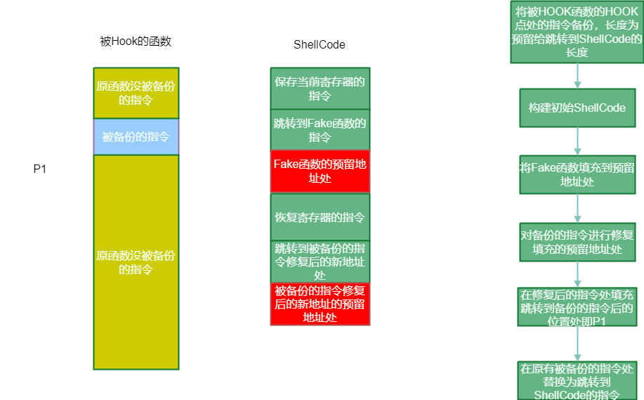
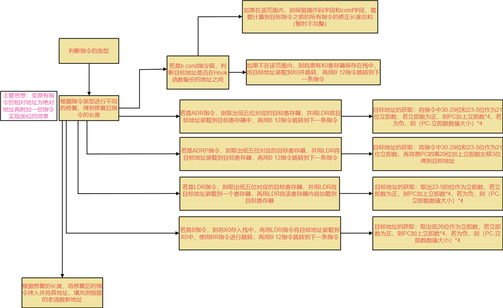

# InlineHook的流程



## 初始化Hook的信息结构

- 对Hook位置的6条指令进行备份装入Hook的信息结构，并判断需要修复的备份指令的长度（通过指令内容与特定的位相与得到的结果来判断指令的类型）

## 构建ShellCode

- 先用栈保存原有寄存器的状态

```assembly
	sub     sp, sp, #0x20

    mrs     x0, NZCV
    str     x0, [sp, #0x10]
    str     x30, [sp]   
    add     x30, sp, #0x20
    str     x30, [sp, #0x8]    
    ldr     x0, [sp, #0x18]

    sub     sp, sp, #0xf0
    stp     X0, X1, [SP]
    stp     X2, X3, [SP,#0x10]
    stp     X4, X5, [SP,#0x20]
    stp     X6, X7, [SP,#0x30]
    stp     X8, X9, [SP,#0x40]
    stp     X10, X11, [SP,#0x50]
    stp     X12, X13, [SP,#0x60]
    stp     X14, X15, [SP,#0x70]
    stp     X16, X17, [SP,#0x80]
    stp     X18, X19, [SP,#0x90]
    stp     X20, X21, [SP,#0xa0]
    stp     X22, X23, [SP,#0xb0]
    stp     X24, X25, [SP,#0xc0]
    stp     X26, X27, [SP,#0xd0]
    stp     X28, X29, [SP,#0xe0]
```

- 通过X0指向栈顶来为FakeFunction传递参数

```assembly
mov     x0, sp
```

- 使用LDR装载目标地址到x3，通过.double进行8字节的占位（用于FakeFunction的函数地址的替换，b 12跳转到blr x3跳转到FakeFunciton

```
 ldr     x3, 8
  b      12
.double 0xffffffffffffffff
  blr    x3
```

- 再恢复原有函数的寄存器状态，通过.double进行8字节的占位用于填充老函数的新地址，再用b指令和blr指令进行跳转

```
 	ldr     x0, [sp, #0x100]
    msr     NZCV, x0

    ldp     X0, X1, [SP]
    ldp     X2, X3, [SP,#0x10]
    ldp     X4, X5, [SP,#0x20]
    ldp     X6, X7, [SP,#0x30]
    ldp     X8, X9, [SP,#0x40]
    ldp     X10, X11, [SP,#0x50]
    ldp     X12, X13, [SP,#0x60]
    ldp     X14, X15, [SP,#0x70]
    ldp     X16, X17, [SP,#0x80]
    ldp     X18, X19, [SP,#0x90]
    ldp     X20, X21, [SP,#0xa0]
    ldp     X22, X23, [SP,#0xb0]
    ldp     X24, X25, [SP,#0xc0]
    ldp     X26, X27, [SP,#0xd0]
    ldp     X28, X29, [SP,#0xe0]
    add     sp, sp, #0xf0
     
    ldr     x30, [sp]
    add     sp, sp, #0x20

    stp     X1, X0, [SP, #-0x10]
    ldr     x0, 8
    b       12
.double 0xffffffffffffffff

    br      x0
```

- 将ShellCode申请内存的起始地址和ShellCode中用于填充老函数的新地址添加到Hook信息结构中

## 构建老函数

- mmap申请一页内存用于修复PC指令的临时存储，申请一块内存将修复后的PC指令拷贝到这块内存，并记录到Hook信息结构
  - 先将用于恢复x0拷贝到指令数组的第一条指令
  - 取出每一个备份的指令进行修复
  
  


## 构建跳转函数

- 在构造的新的老函数后指令后，填充跳转到HOOK函数被备份的之后的位置

- 在被HOOK位置处填充跳转到ShellCode代码处
